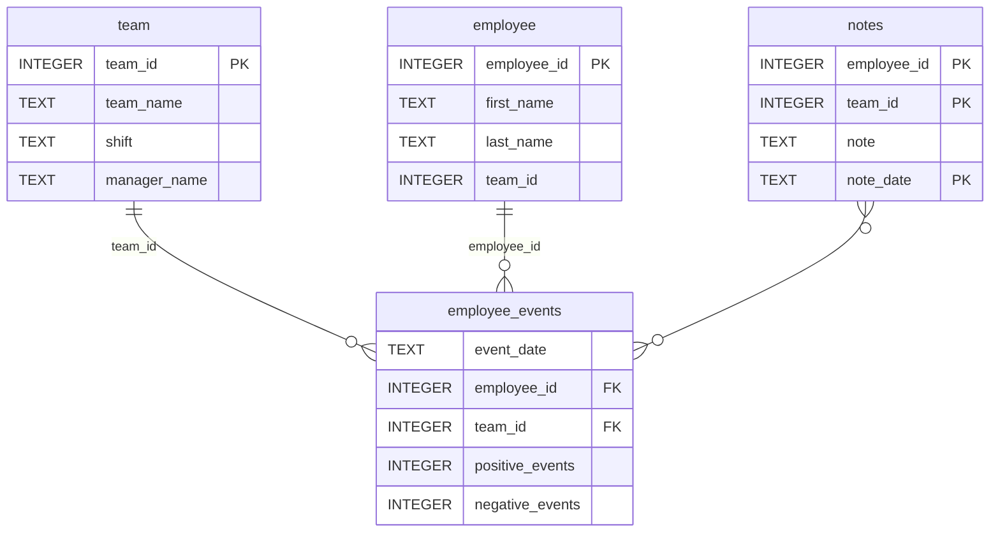

# Employee Events Dashboard

A data science dashboard that lets managers monitor an employee's (or a team's)
performance and their predicted risk of being recruited by another company.
Built with a custom Python package for SQL access, scikit-learn for prediction,
and FastHTML for the dashboard interface.

## Repository Structure
├── README.md

├── assets

│   ├── model.pkl

│   └── report.css

├── python-package

│   ├── employee_events

│   │   ├── init.py

│   │   ├── employee.py

│   │   ├── employee_events.db

│   │   ├── query_base.py

│   │   ├── sql_execution.py

│   │   └── team.py

│   ├── requirements.txt

│   ├── setup.py

├── report

│   ├── base_components

│   │   ├── init.py

│   │   ├── base_component.py

│   │   ├── data_table.py

│   │   ├── dropdown.py

│   │   ├── matplotlib_viz.py

│   │   └── radio.py

│   ├── combined_components

│   │   ├── init.py

│   │   ├── combined_component.py

│   │   └── form_group.py

│   ├── dashboard.py

│   └── utils.py

├── requirements.txt

├── tests

└── test_employee_events.py


## Database Schema (employee_events.db)


## Setup Instructions

### 1. Clone the repository
```bash
git clone https://github.com/MOHAMMED-banabila/dsnd-dashboard-project.git
cd dsnd-dashboard-project
```

### 2. Create and activate a virtual environment
Requires **Python 3.11 or higher**.
```bash
python3.11 -m venv venv
source venv/bin/activate        # On Windows: venv\Scripts\activate
```

### 3. Install dependencies
```bash
python -m pip install --upgrade pip
pip install -r requirements.txt
```

### 4. Build and install the Python package
```bash
cd python-package
python setup.py sdist
pip install .
cd ..
```

## Running the Dashboard
```bash
cd report
python dashboard.py
```
Then open the printed URL (usually `http://localhost:5001`) in your browser.
Stop the server with `Ctrl+C`.

## Running the Tests
From the project root:
```bash
pytest
```

## Notes on Dependencies
This project pins specific versions to avoid FastHTML compatibility issues:
`python-fasthtml==0.8.0`, `fastcore==1.7.19`, `starlette==0.38.2`,
`fastlite==0.0.11`. All are captured in `requirements.txt`.

## Continuous Integration
A GitHub Action (`.github/workflows/test.yml`) runs the test suite automatically
on every push to the `main` branch.

